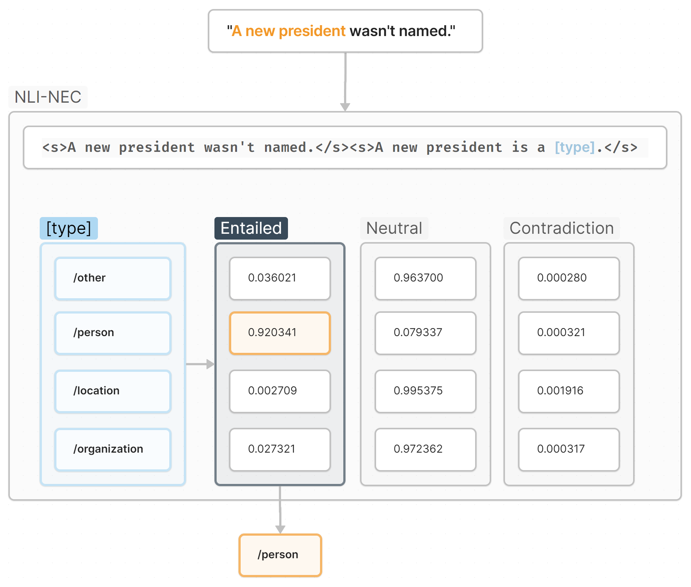

<h1 align="center" style="margin-top: 0px;">Classification of Named Entities at Varying Granularity with Transformer-Based Natural Language Inference</h1>
<h2 align="center" style="margin-top: 0px;">Formal Semantics: Student Project</h2>

<div align="center">

[](https://github.com/psaegert/nli-nec/actions/workflows/pytest.yml)
[](https://github.com/psaegert/nli-nec/actions/workflows/pre-commit.yml)

</div>



# Introduction
In this work, I use the [`roberta-large-mnli`](https://huggingface.co/roberta-large-mnli) model to perform zero-shot and fine-tuned Named Entity Classification (NEC) at varying type granularity by reformulating the NEC task as a Natural Language Inference (NLI) task. To query the type of an entity in a sentence, the following pattern is used:

```
<s>[sentence]</s><s>[entity] is a [type]</s>
```

The type is then determined by the maximum entailment probability among all possible types.

# Models
The models are fine-tuned on the augmented OntoNotes from the [Ultra-Fine Entity Typing dataset](https://www.cs.utexas.edu/~eunsol/html_pages/open_entity.html).

| Model | Description |
| --- | --- |
| [roberta-large-mnli](https://huggingface.co/roberta-large-mnli) | NLI-fine-tuned base model |
| [nlinec-C-medium](https://huggingface.co/psaegert/nlinec-C-medium) | NLI+NEC-fine-tuned on all NEC data @ medium granularity |
| [nlinec-D-coarse](https://huggingface.co/psaegert/nlinec-D-coarse) | NLI+NEC-fine-tuned on 10% NEC data @ coarse granularity |
| [nlinec-D-medium](https://huggingface.co/psaegert/nlinec-D-medium) | NLI+NEC-fine-tuned on 10% NEC data @ medium granularity |
| [nlinec-D-fine](https://huggingface.co/psaegert/nlinec-D-fine) | NLI+NEC-fine-tuned on 10% NEC data @ fine granularity |
| [nlinec-E-medium](https://huggingface.co/psaegert/nlinec-E-medium) | NLI+NEC-fine-tuned on positive-only 10% NEC data @ medium granularity |

A detailed description of the models and their rationale can be found in the [model rationale diagram](docs/assets/model-tree-rationale.png)

# Results
The Maximum Entailment Accuracy at each granularity and the Multi-NLI Accuracy of the models are shown in the table below.
| Model | Coarse | Medium | Fine | Multi-NLI |
| --- | --- | --- | --- | --- |
| [roberta-large-mnli](https://huggingface.co/roberta-large-mnli) | 0.46 | 0.35 | 0.44 | **0.90** |
| [nlinec-C-medium](https://huggingface.co/psaegert/nlinec-C-medium) | 0.67 | 0.69 | 0.70 | 0.74 |
| [nlinec-D-coarse](https://huggingface.co/psaegert/nlinec-D-coarse) | **0.88** | 0.47 | 0.63 | 0.84 |
| [nlinec-D-medium](https://huggingface.co/psaegert/nlinec-D-medium) | 0.61 | **0.70** | 0.71 | 0.82 |
| [nlinec-D-fine](https://huggingface.co/psaegert/nlinec-D-fine) | 0.53 | 0.63 | **0.73** | 0.81 |
| [nlinec-E-medium](https://huggingface.co/psaegert/nlinec-E-medium) | 0.16 | 0.07 | 0.12 | 0.70 |

Further results and evaluations can be found in the [results notebook](notebooks/results.ipynb) and the [results directory](results).


# Getting Started

## Requirements
- Python 3.10
- GPU (optional, but recommended)

## Create a virtual environment
```bash
conda create -n nli-nec python=3.10
conda activate nli-nec
```

## Install the package
```bash
pip install -e .
```

## Fine-Tuning & Evaluation
Please note that running the fine-tuning or evaluation for the first time may take a very long time due to the creation of negative data.
For subsequent runs, the data is cached in `/data/derived/negative_data`.

### Download the data
Download the NEC data to the `/data` directory with the following command:
```bash
nlinec download-data
```

### Fine-tune the model
Fine-tune the `roberta-large-mnli` model on the NEC data with the following commands:
| Model | Command |
| --- | --- |
| [nlinec-C-medium](https://huggingface.co/psaegert/nlinec-C-medium) | `nlinec train my-nlinec-C-medium -g 2 -r 42` |
| [nlinec-D-coarse](https://huggingface.co/psaegert/nlinec-D-coarse) | `nlinec train my-nlinec-D-coarse -g 1 -r 42 -t 81408` |
| [nlinec-D-medium](https://huggingface.co/psaegert/nlinec-D-medium) | `nlinec train my-nlinec-D-medium -g 2 -r 42 -t 81408` |
| [nlinec-D-fine](https://huggingface.co/psaegert/nlinec-D-fine) | `nlinec train my-nlinec-D-fine -g 3 -r 42 -t 81408` |
| [nlinec-E-medium](https://huggingface.co/psaegert/nlinec-E-medium) | `nlinec train my-nlinec-E-medium -g 2 -r 42 -t 81408 -n 0` |

### Predict the types
To predict the types of the entities in the test set, please execute the [prediction notebook](notebooks/predict.ipynb).

### Evaluate the predictions
To evaluate the predictions, please execute the [evaluation notebook](notebooks/evaluate.ipynb).

# Contributing
I use
- [flake8](https://pypi.org/project/flake8/) to enforce linting
- [mypy](https://pypi.org/project/mypy/) to enforce static typing
- [isort](https://pypi.org/project/isort/) to enforce import sorting
- [pytest](https://pypi.org/project/pytest/) to run tests against our code (see `tests/`)

To set up the pre-commit hooks, run the following command:
```bash
pre-commit install
```

# Citation
```bibtex
@misc{saegert-2023-nlinec,
    title = "Classification of Named Entities at Varying Granularity with Transformer-Based Natural Language Inference",
    author = "Paul Saegert",
    year = "2023",
    url = "https://github.com/psaegert/nli-nec"
}
```